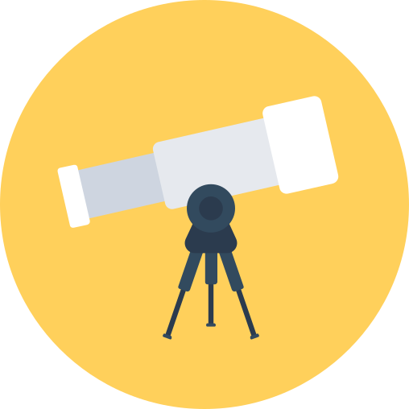
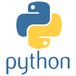
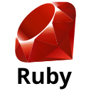
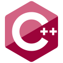
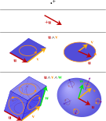
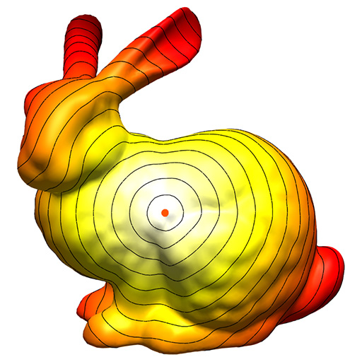
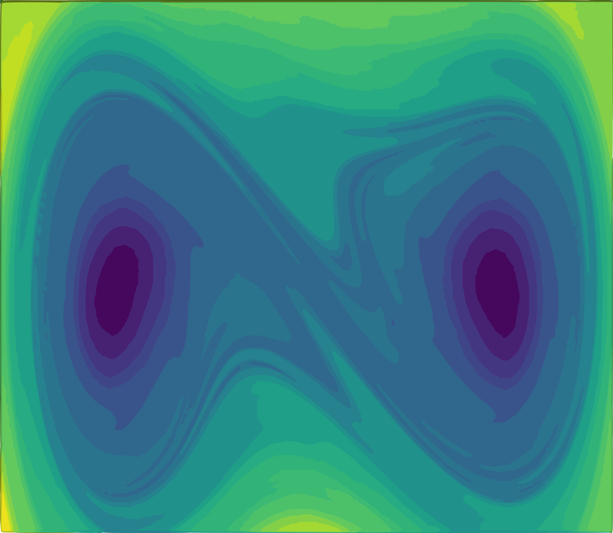
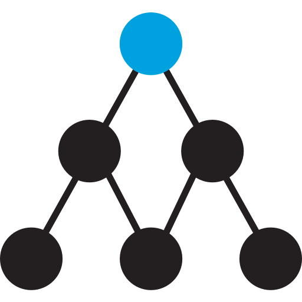
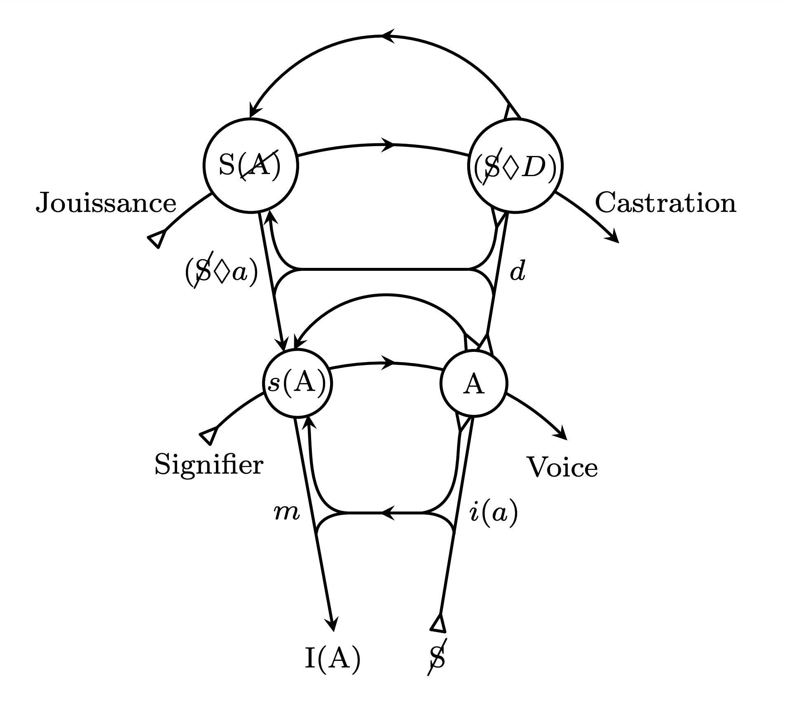

### 👋 Hi, I'm Utensil

<!-- <a href="https://stackoverflow.com/u/200764" class="tooltipped tooltipped-se" aria-label="Stack Overflow: 200764">
  <svg height="24" fill="#959da5" xmlns="http://www.w3.org/2000/svg" viewBox="0 0 120 120"><path class="st0" d="M84.4 93.8V70.6h7.7v30.9H22.6V70.6h7.7v23.2z"></path><path class="st1" d="M38.8 68.4l37.8 7.9 1.6-7.6-37.8-7.9-1.6 7.6zm5-18l35 16.3 3.2-7-35-16.4-3.2 7.1zm9.7-17.2l29.7 24.7 4.9-5.9-29.7-24.7-4.9 5.9zm19.2-18.3l-6.2 4.6 23 31 6.2-4.6-23-31zM38 86h38.6v-7.7H38V86z"></path></svg>
</a>
<a href="https://www.facebook.com/utensilsong" class="tooltipped tooltipped-se" aria-label="Facebook: utensilsong">
  <svg height="20" xmlns="http://www.w3.org/2000/svg" viewBox="0 0 15.3 15.4"><path d="M14.5 0H.8a.88.88 0 0 0-.8.9v13.6a.88.88 0 0 0 .8.9h7.3v-6h-2V7.1h2V5.4a2.87 2.87 0 0 1 2.5-3.1h.5a10.87 10.87 0 0 1 1.8.1v2.1h-1.3c-1 0-1.1.5-1.1 1.1v1.5h2.3l-.3 2.3h-2v5.9h3.9a.88.88 0 0 0 .9-.8V.8a.86.86 0 0 0-.8-.8z" fill="#959da5"></path></svg>
</a>
<a href="https://www.linkedin.com/in/utensil" class="tooltipped tooltipped-se" aria-label="LinkedIn: utensil">
  <svg height="20" xmlns="http://www.w3.org/2000/svg" viewBox="0 0 19 18"><path d="M3.94 2A2 2 0 1 1 2 0a2 2 0 0 1 1.94 2zM4 5.48H0V18h4zm6.32 0H6.34V18h3.94v-6.57c0-3.66 4.77-4 4.77 0V18H19v-7.93c0-6.17-7.06-5.94-8.72-2.91z" fill="#959da5"></path></svg>
</a>
<a href="https://t.me/utensil" class="tooltipped tooltipped-se" aria-label="Telegram: utensil">
  <svg height="20" viewBox="0 0 20 17" fill="none" xmlns="http://www.w3.org/2000/svg"><path d="M19.9434 1.52996L16.9243 15.7574C16.7018 16.7662 16.1009 17.011 15.2627 16.5362L10.6637 13.1463L8.44574 15.2826C8.20095 15.5274 7.99325 15.7351 7.51851 15.7351L7.84489 11.0545L16.368 3.35475C16.7389 3.02836 16.2864 2.84292 15.7968 3.1693L5.26349 9.80084L0.723777 8.38403C-0.262794 8.07249 -0.285048 7.39746 0.931477 6.92272L18.6675 0.0834836C19.4909 -0.21323 20.2104 0.283765 19.9434 1.52996Z" fill="#959DA5"></path></svg>
</a> -->

Github is where I explore ideas, write stuff, contribute to or create open-source projects out of personal interest. It's part of my spiritual life, independent of my professional career. I've been coding since my 6th grade (1999), coding connects me with the world: how things work, how I can interact with their internals and build things as how I imagine.

<a href="https://github.com/utensil">

<!--  -->
</a>

**Programming Languages in use:** 

<!-- 
 -->

<!--  -->

**Programming Languages to learn:** 

<!--  -->

<!-- 

 -->

<!-- **Tech Stack:**  -->

<!-- 

 -->
<!-- 

 -->

**Interests:** 

<!--

**Projects:** 

| **Working on** | **Maintaining**  |
|----------------|------------------|
|||

| **Sharing**    | **Experimenting** |
|----------------|-------------------|
|  | |
|  | |
|  | |
-->
